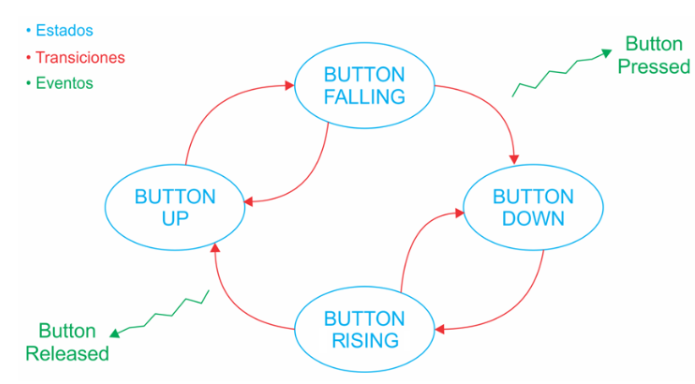

# Ejercicios Prácticos del curso Programación de Microcontroladores

Autora: Josselyn Ordóñez

## Práctica 1

Se configura parpadeo de leds según una secuencia definida, y el cambio del orden de frecuencia al presionar el botón user.

## Práctica 2

Se crean funciones para generar y utilizar delays no bloqueantes y se utilizan para hacer parpadear uno de los leds.

## Práctica 3

Se modulariza las funciones del delay no bloqueante y se crea una nueva función para validar si el delay está corriendo o no (delayIsRunning).

Se implemente parpadeo de led con diferentes tiempos utilizando el nuevo módulo de delay.

## Practica 4

### Punto 1

Se implementa una MEF anti-rebote que permita leer el estado del pulsador de la placa NUCLEO-F4 y generar acciones o eventos ante un flanco descendente o ascendente, de acuerdo al siguiente diagrama:

### Punto 2

Se implementa un módulo de software en un archivo fuente API_debounce.c con su correspondiente archivo de cabecera API_debounce.h que contienen la lógica anti-rebote.

Se crea dentro del módulo una función readKey que lee una variable interna del módulo y devuelve true o false si la tecla fue presionada.

Se implementa un programa que cambie la frecuencia de parpadeo del LED entre 100 ms y 500 ms cada vez que se presione la tecla.  El programa usa las funciones anti-rebote del módulo API_debounce y los retardos no bloqueantes del módulo API_delay y la función readKey.
